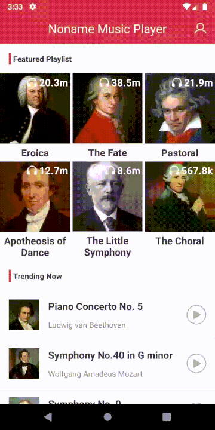

# Noname_Android_Music_Player
An Android music player using Realm database and integrated with many third party libraries such as RecyclerView, CircleImageView, Glide, etc.

Here are the demos of:
1. Sign up and login function;

2. Music play function;

3. This app calls MediaPlayer service to play music rather than use activities or apps. Hence, the music won't stop even when users killed the app.

